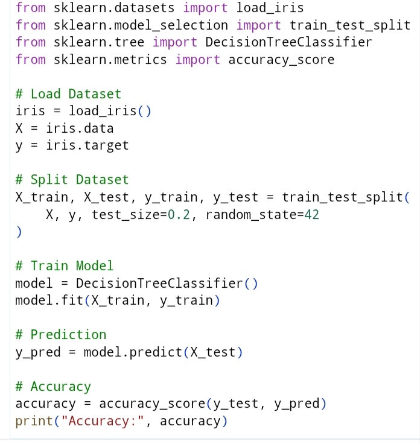
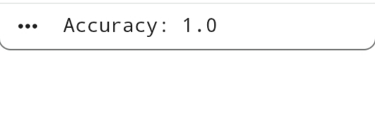

# Project-2- Data Classification Using AI

## Description
This project demonstrates a basic AI-based data classification model using supervised machine learning. It trains a model on a dataset and predicts the correct class for new data.

## Features
- Load and preprocess dataset
- Train a classification model
- Test model accuracy
- Predict data classes
- Simple and beginner-friendly

## How It Works
1. Load the dataset
2. Split data into training and testing sets
3. Train the AI model
4. Make predictions
5. Display the accuracy and output

## Tools Used
- Python
- Google colab 
- NumPy

## Output
The model successfully classifies the input data and displays the prediction results along with the accuracy score.

## Screenshots

### Code Screenshot

### Output Screenshot

## Note
This project was completed as part of an AI Internship to understand the basics of supervised learning and data classification.
